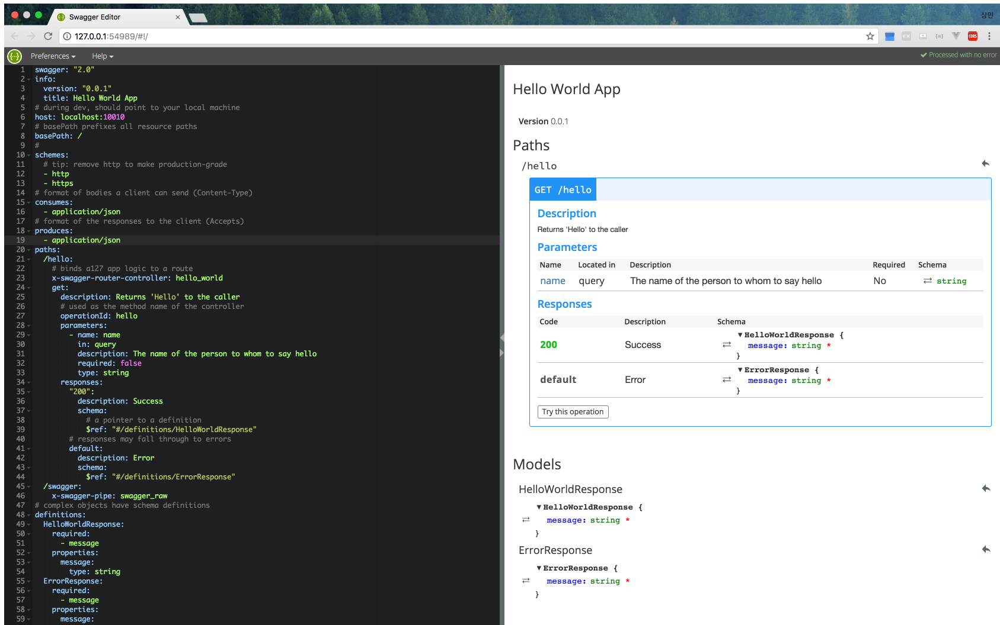
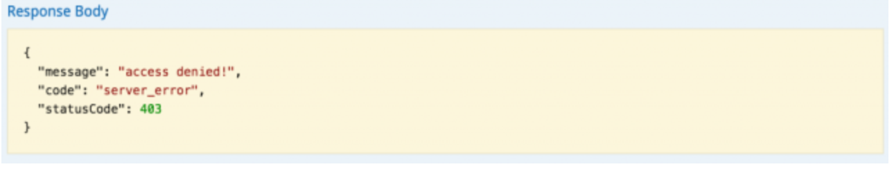
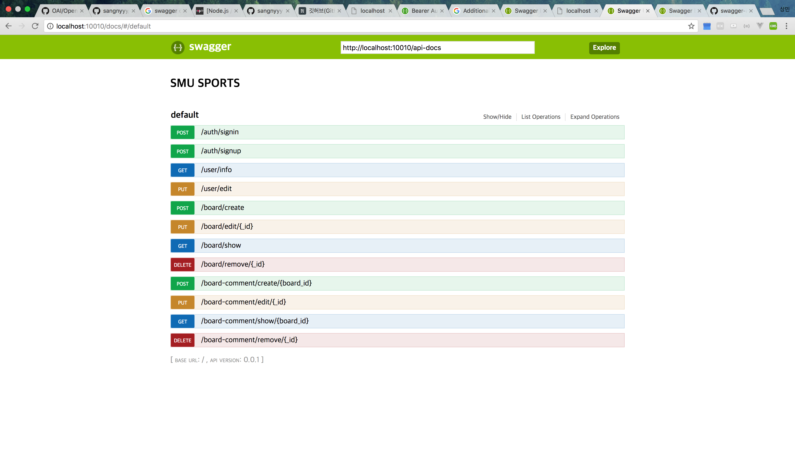

# Swagger Start with Express


## Install swagger
```bash
$ npm install -g swagger
```

## Command 
```bash
$ swagger project create "project-name"
$ swagger project edit "project-name"
$ swagger project verify "project-name"
$ swagger project start "project-name"
$ swagger project test "project-name"
```

## Structure

```bash
/project-name
    /api
        /controller
        /helpers
        /mocks
        /swagger
    /config
    /node_modules
    /test
```

## API Design

```bash
$ swagger project edit
```



/api/swagger/swagger.yaml:
```yaml
paths:
  /hello:
    x-swagger-router-controller: hello_world
    get:
      description: Returns 'Hello' to the caller
      operationId: hello 
```
### x-swagger-router-controller
The value assigned to the x-swagger-router-controller key is the JavaScript filename in the controllers folder.

### operationId
operationId is mapped with method of x-swagger-router-controller javascript file method.

## Swagger-ui interlock

app.js:
```javascript
var SwaggerUi = require('swagger-tools/middleware/swagger-ui');

SwaggerExpress.create(config, function(err, swaggerExpress) {

  // add swagger-ui (/docs)
  app.use(SwaggerUi(swaggerExpress.runner.swagger));

  // install middleware
  swaggerExpress.register(app);

});
``` 
You can check swagger-ui by accessing the / docs path to your browser.

## api key setting
app.js:
```javascript
var config = {
  appRoot: __dirname, // required config

  swaggerSecurityHandlers: {
    api_key: function (req, authOrSecDef, scopesOrApiKey, cb) {
      // your security code
      if ('1234' === scopesOrApiKey) {
        cb();
      } else {
        cb(new Error('access denied!'));
      }
    }
  }
};
```

/api/swagger/swagger.yaml:
```yaml
securityDefinitions:
  api_key:
    type: apiKey
    in: query
    name: api_key
security:
  - api_key: [  ]   
```

without api key:


## Dynamic hosting
app.js:
```javascript
SwaggerExpress.create(config, function(err, swaggerExpress) {
  if (err) { throw err; }

  // Dynamic swagger host
  swaggerExpress.runner.swagger.host = 'server ip'
  
  // add swagger-ui (/docs)
  app.use(SwaggerUi(swaggerExpress.runner.swagger));

```

## Swagger-ui Screen-Shot


> PUT 메소드 사용시에 렌더링이 안되는 문제가 발생했었으나 Swagger-UI 버전 2.2.0을 설치하여 <br/>
node_modules/swagger-tools/middleware의 swagger-ui를 새로 다운로드 받은것으로 교체해줌!

## References
<http://blog.jeonghwan.net/swagger-node/>
